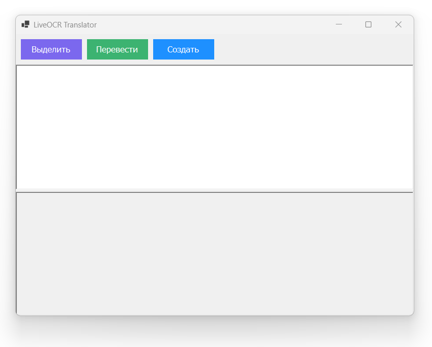
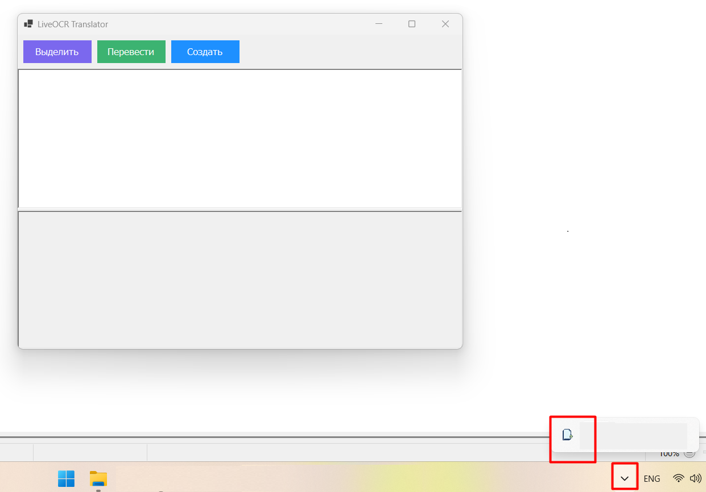
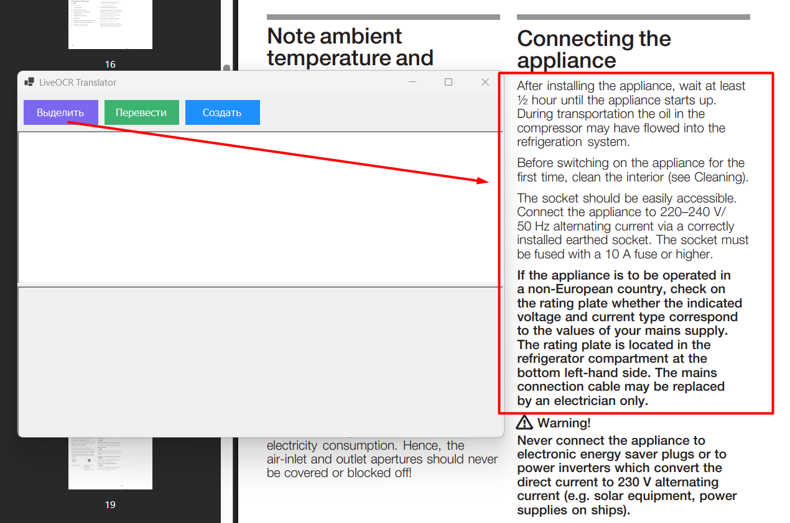
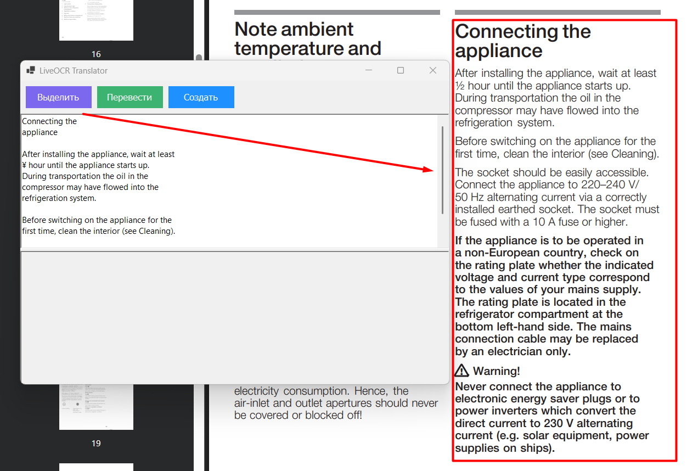
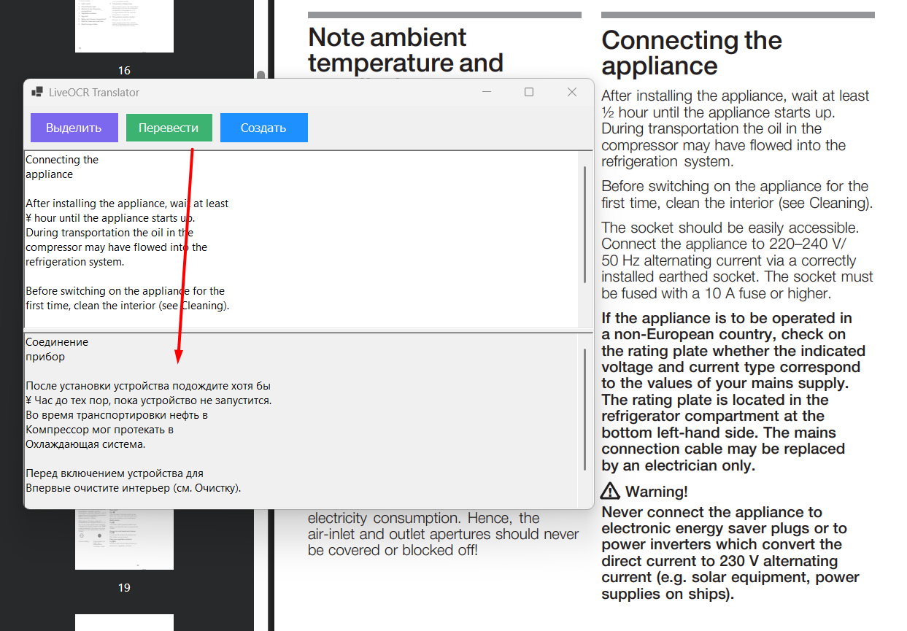
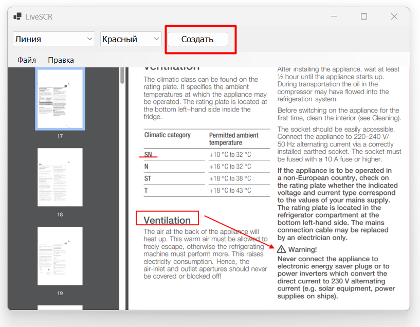

# LiveOCR-Translator

> Этот проект разработан **в личных целях для обучения и развития навыков программирования** на C#, работы с OCR и созданием удобных инструментов для пользователей.  
> Он демонстрирует практическое применение Tesseract OCR.

**LiveOCR Translator** - это десктопное приложение на C# для Windows, которое позволяет распознавать текст с помощью OCR (Tesseract) и переводить его.

Приложение создано для случаев, когда **нельзя просто скопировать текст**: PDF-файлы, изображения, окна приложений и другие интерфейсы. Оно экономит время и избавляет от ручного ввода текста, позволяя работать максимально эффективно.

---

## Основные функции

1. **Выделение области экрана**  
   - Пользователь может выбрать область на экране для захвата текста.
   - Идеально подходит для PDF, изображений и приложений, где текст нельзя скопировать.  
   - Позволяет избежать ручного ввода текста - всё делается автоматически.  

2. **Распознавание текста (OCR)**  
   - Используется Tesseract OCR для распознавания текста на русском и английском.  
   - Результат отображается в верхней панели приложения и копируется в буфер обмена.  

3. **Автоматический перевод текста**  
   - Определяет язык текста и переводит на русский или английский с помощью Google Translate API.  
   - Перевод отображается в нижней панели и копируется в буфер обмена.  

4. **Интерфейс**  
   - Две панели: оригинальный текст (OCR) и перевод.  
   - Кнопки: "Выделить", "Перевести", "Создать" для управления захватом и переводом.  

5. **Работа с трей-иконкой**  
   - Приложение сворачивается в трей для фонового использования.  
   - Контекстное меню и двойной клик позволяют быстро открыть приложение или выйти.  

6. **Скриншот и захват области**  
   - После выделения области, снимок экрана автоматически копируется в буфер обмена.
   - Есть возможность **сохранить скриншот на диск через "Сохранить как"**, чтобы использовать изображение отдельно.  
   - Можно использовать разные инструменты выделения на скриншоте: прямоугольник, стрелка, линия подчеркивания.
   - Встроена поддержка горячих клавиш ctrl + z (отмена выделения).
  
7. **Отладка и логирование**  
   - Сохраняются изображения захваченных областей (`debug_capture.png`) для проверки корректности распознавания.  
   - Консольное логирование всех операций для разработчика.  

---

## 📸 Скриншоты
1.Интерфейс приложения

2.Загрузка приложения в трей

3.Выделить и обнаружить текст

4.Перевести обнаруженный текст

5.Скриншот

---

## ⚡ Использование

1. Запустите приложение — оно сворачивается в трей и всегда доступно.  
2. Нажмите **"Выделить"**, чтобы выбрать область экрана с текстом.  
3. После выделения текста он появится в верхней панели (OCR-текст) и **копируется в буфер обмена**.  
4. Нажмите **"Перевести"**, чтобы получить перевод текста в нижней панели.  
5. Используйте кнопку **"Создать"**, чтобы  сделать скриншот.  
6. Esc отменяет выделение области.

---

## 💻 **Скачать и собрать приложение**

### 1. Скачивание
Скачайте **все части архива** из этого репозитория (LiveOCR.7z.001 / LiveOCR.7z.002).  
**Важно:** все части должны находиться в одной папке и иметь оригинальные имена.

### 2. Установка 7-Zip
Для распаковки необходимо установить [7-Zip](https://www.7-zip.org/).  
- Скачайте и установите версию для Windows (x64 или x86, в зависимости от вашей системы).

### 3. Сборка архива

1. Перейдите в папку с загруженными частями.  
2. Кликните правой кнопкой мыши на **первый файл `.001`** → **7-Zip → Extract Here** (или **Extract to "LiveOCR"**).  
3. 7-Zip автоматически объединит все части и распакует папку с приложением.

### 4. Запуск приложения

1. После распаковки откройте папку `LiveOCR`.  
2. Найдите файл `LiveOCR.exe`.  
3. Дважды кликните `.exe`, чтобы запустить приложение.  

> Приложение self-contained, поэтому **не требует установки .NET**.
---

## **Советы**

- **Не переименовывайте части архива**, иначе сборка может не сработать.  
- Если возникнут ошибки при распаковке, убедитесь, что скачаны **все части** архива полностью.  
- Для Windows 11/10 желательно запускать с правами пользователя, который имеет доступ к папке с приложением.

---

Теперь приложение можно использовать сразу после распаковки.  

---

## 🛠 Технологии и ссылки

- C# (.NET Framework / .NET 9.0) — [Скачать .NET](https://dotnet.microsoft.com/ru-ru/download/dotnet/9.0)  
- Windows Forms (WinForms) — [Документация](https://learn.microsoft.com/ru-ru/dotnet/desktop/winforms/?view=netdesktop-7.0)  
- [Tesseract OCR](https://github.com/tesseract-ocr/tesseract/releases)  
- Статья о Google Translate на Habr: [Ссылка](https://habr.com/ru/news/599037/)  
- System.Drawing / GDI+ для захвата экрана и рисования выделений — [Документация](https://learn.microsoft.com/ru-ru/dotnet/desktop/winforms/advanced/graphics-and-drawing?view=netdesktop-7.0)  
- HttpClient для работы с Google Translate — [Документация](https://learn.microsoft.com/ru-ru/dotnet/api/system.net.http.httpclient?view=net-7.0)  
- Clipboard для автоматического копирования текста и скриншотов — [Документация](https://learn.microsoft.com/ru-ru/dotnet/api/system.windows.forms.clipboard?view=windowsdesktop-7.0)  

---

## 🔮 Планы на будущее

- Добавить кнопку для копирования перевода в буфер обмена  
- Автоматическая очистка окна перевода после очистки основного экрана
- Возможность захвата видео  
- Улучшить внешний вид интерфейса (опционально)  
- Поддержка других устройств/мониторов (опционально)  
- Поддержка дополнительных языков OCR (опционально)  
- Интеграция горячих клавиш для быстрого захвата текста (опционально)
